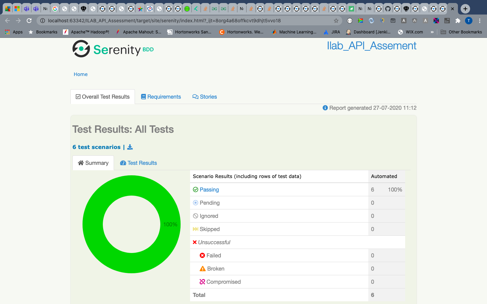
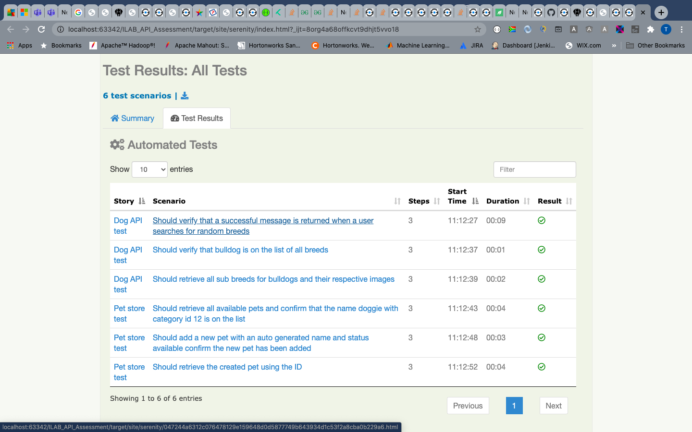
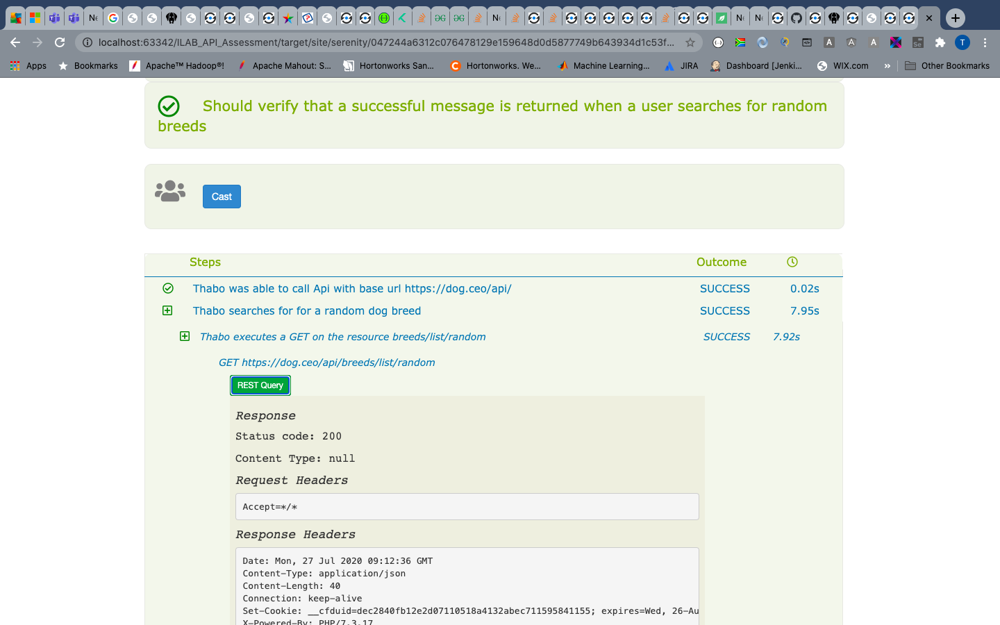

Project structure

    feature:
        The project root is in the feature package; each feature package has project info which describes what each feature 
        file does. 
        Each feature is written in an English like language in order for stakeholder from all background to understand.
     Tasks
        The actual implementation defining steps taken to perform a certain action
    Question
        Question asked to make sure action preformed resulted in expected results
     
Running the Project

    Run all Tests: mvn clean verify
    Run Sepecif Test: mvnc clean verify -Dtags="tagName"
 
Report:
    Url
        target/site/serenity/index.html
    sample report
        
        
        
        
        
        
    
